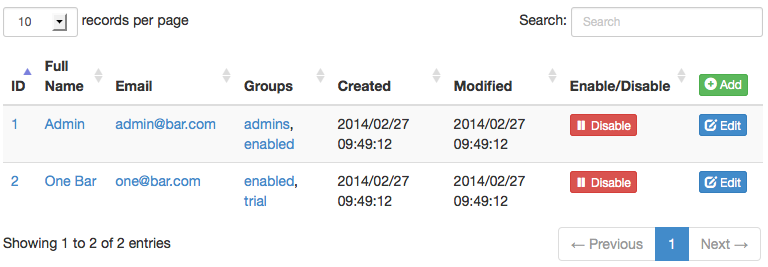
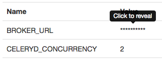
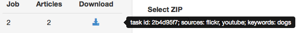
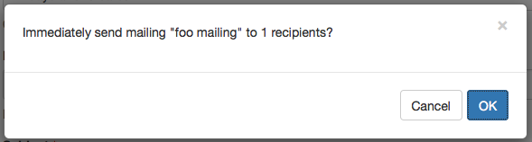

==========
JavaScript
==========

Dynamic tables
--------------

    `Screenshot of a dinamic table.`

The ``pyramid_bimt`` package comes bundled with the `jQuery.datatables` plugin.
To use it in your view add the following to your view code:

.. code-block:: python

    from pyramid_bimt.static import table_assets
    table_assets.need()

Then in your template, make sure your table looks something like this:

.. code-block:: html

    <table class="table datatable">
      <thead>
        <tr>
          <th>Foo</th>
          <th>Bar</th>
        </tr>
      </thead>
      <tbody>
        <tr><td>1</td><td>2</td></tr>
        <tr><td>3</td><td>4</td></tr>
        <tr><td>5</td><td>6</td></tr>
      </tbody>
    </table>

To disable sorting on a column add ``data-sort-disabled="true"`` as its
attribute, like so:

.. code-block:: html

    <th data-sort-disabled="true">Bar</th>

Show 'secret' info on click
---------------------------

    `Screenshot of a secret span.`

If you need to show a secret string in a template, use the `secret` span
approach. This means to print ``*`` instead of actual secret string in a span
with class ``secret``, but include the secret in the ``data-secret`` attribute.
Example:

.. code-block:: html

    

When user clicks on the span, the ``*`` characters will be replaced with the
actual password, so user can see & copy it.

Display a nice tooltip
----------------------

    `Screenshot of a tooltip.`

To display a nice tooltip on an arbitrary DOM element, do the following:

* add ``data-toggle="tooltip"`` attribute to enable tooltips
* add ``data-placement="right"`` to tell the tooltip where to show itself
* add ``title="foobar"`` to tell the tooltip what text to show

Example:

.. code-block:: html

    

More info and options at http://getbootstrap.com/javascript/#tooltips.

Confirmation before form submit
-------------------------------

    `Screenshot of a form confirmation.`

Sometimes you want the user to explicitly confirm that they want to submit
a certain form. We use ``bootbox.js`` to drive this functionality. Enable it
by adding the ``btn-confirmation`` class to the form button that you want
confirmation for, like so:

.. code-block:: python

  class MyForm(FormView):
      buttons = (
          deform.Button(
              name='remove',
              css_class='btn-warning btn-confirmation',
              value='Are you sure?',
          ),
      )

